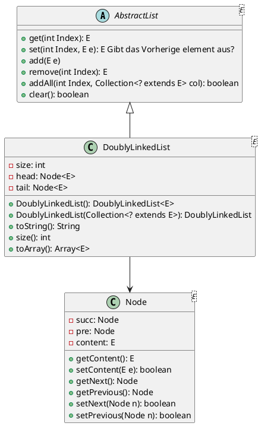
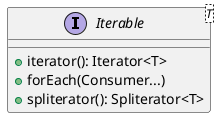

% Title: 
% Author: FG 
% Date: 2024-05-20 
--- 

# Notizen zu ADP2

## A1 - Doubly Linked List 

=> PM2 Praktikum 2 

Interface Abstract List: 

### add 
- erzeugt neuen Node, 
- fügt das Elemente in Node ein 
- Setzt Succ und Pre der vorgänger und nachfolger 
- erhöht den Counter size um 1
- wird immer direkt vor Tail eingesetzt 

### addAt(index)

- erzeugt neuen Node, 
- fügt das Elemente in Node ein 

- man muss sich über die Knoten vorwärts arbeiten 
- Man beginnt bei Head 
- Zählt dann eine For-schleife bis index hoch 
- bei jedem schleifen durchlauf holt man sich den currentNode als succ des vorheringen nodes 
- wenn man bei index angekommen ist, 
  - Setze Succ und Pre der vorgänger und nachfolger 

### remove

### addAll 
- Iteriert über die Gebenen Collection und Added die Elemente 

### Kopierkonstruktor 

- erzeuge neue DoublyLinkedList 
- benutze addAll um die Übergebene Collection in die Liste auf Zu Nehmen 

### Clear (oder Remove All)
- ganz simple: 
  - Setze den succ von head auf tail
  - und setze den pre von tail auf head 
  - Damit sind alle knoten dazwischen tot//weg 
=> Kein for/forEach  

### Stream??? 
=> PM2 Praktikum 3 

Siehe : "C:\Users\fabia\Documents\Wichtig\110_Informatik_Studium\60_Studium\20_Semester_SoSe_2023\PM2\10_Folien_New\v5 Lambdas und Functional Interfaces_Korrigiert.pdf"

PM2 Script 5 : v5 Lambdas und Functional Interfaces_Korrigiert.pdf
Ab Seite 52 

=> Stream benötigen interface Iterable 
